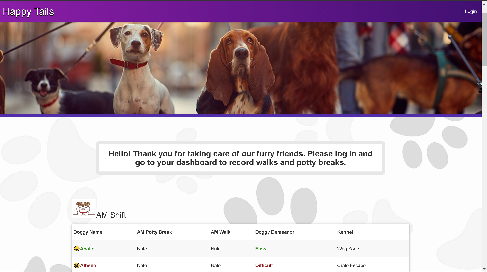
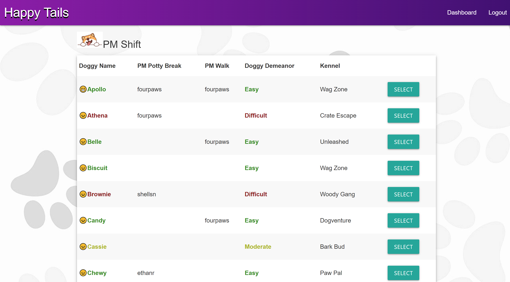
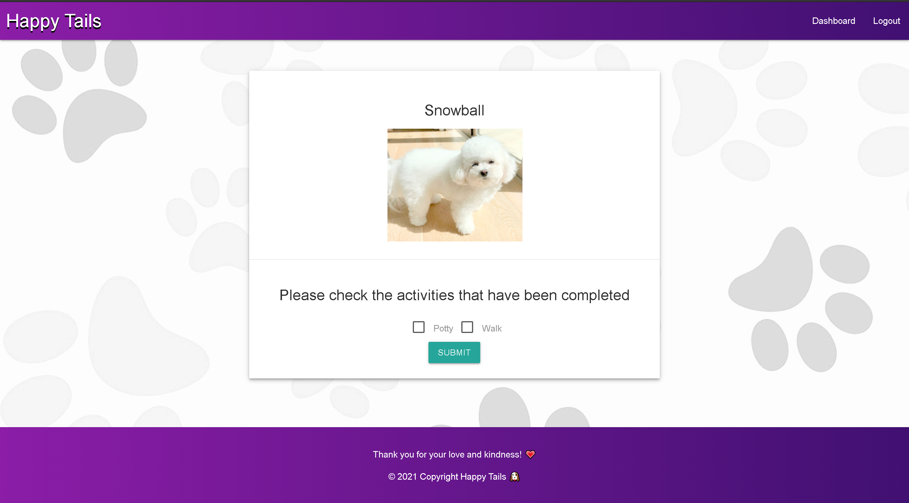
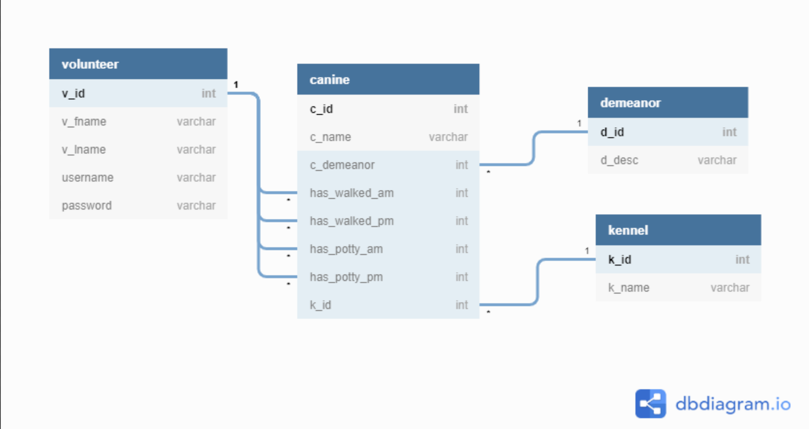

# Happy Tails

## Table of Contents
1. [Description](#description)
2. [Installation](#installation)
3. [Usage](#usage)
4. [License](#license)
5. [Contributing](#contributing)
6. [Tests](#tests)
7. [Questions](#questions)

## Description
This is a task tracking site that was created using the Model, View, Controller paradigm.  This site is currently hosted on Heroku at [Heroku Deployment](https://happy-happy-tails.herokuapp.com/) and can also be run locally using the files located in the GitHub repository [Github](https://github.com/nystephens/happy-tails).  To learn how to run this server locally please continue reading the [Installation](#installation) and [Usage](#usage) sections.  

USER STORY:
AS a shelter employee/volunteer, I WANT to track the dogs daily activities and dogs difficulty levels so that all the dogs are taken care of and paired with a compatible caretaker that meets the required experience.

WHEN I go to the site, and am not logged in, 
THEN I am presented with a page that lists all the dogs in the shelter. 
WHEN on the homepage I can click a link in the navbar to login.
IF I don’t have an account THEN I will be prompted to sign up.
WHEN I enter my password to sign up 
THEN that password is safely encrypted using the bcrypt package.
WHEN I enter a valid username and password 
THEN I am able to login.
WHEN I login I am redirected to the Dashboard.

IF I use my Dashboard I am able to quickly identify the dogs that haven’t had a potty break or walk via a table for the current shift.
IF I want to filter dogs by difficulty THEN a checkbox allows me to select difficulty level.  
IF I check a box THEN only those dogs with the selected difficulty levels are displayed. (Easy, Moderate, Difficult).
IF I want to see all dogs who have been walked for that shift,
OR I want to see all dogs who haven't been walked for that shift,
THEN I can select a dropdown option to veiw those dogs.
IF I want to see all dogs who have gone potty for that shift,
OR I want to see all dogs who haven't gone potty for that shift,
THEN I can select a dropdown option to veiw those dogs.
IF I want to see all dogs who have been walked AND gone potty for that shift,
OR I want to see all dogs who haven't been walked OR gone potty for that shift,
THEN I can select a dropdown option to veiw those dogs.

WHEN I take the dog on a walk or to go potty THEN I am able to record that acivity on the table.
IF I click a dog row on the table 
THEN I am able to edit the dog's activity record for that shift.
WHEN I check "Walk" 
THEN my username appears in the walk column for that dog.
WHEN I check "Potty" 
THEN my username appears in the potty column for that dog.
WHEN I have filled out both activity columns for that dog THEN the emoji next to their name displays a happy face.
WHEN new activity is recorded for a dog
THEN an email notification is sent via Nodemailer to a designated handler's email.

This application was created using Node.js, express to launch the server, and sequelize to connect to a mysql database entitled "happy_tails_db".  All volunteer, canine, and activity data is stored in happy_tails_db.  The live app is currently deployed on Heroku, using the JAWSDB add on to store data.  All passwords have been encrypted using the bcrypt Node.js package.  The HTML views templates are generated using Handlebars.js.

## Installation
1.  Navigate to the GitHub repository ( https://github.com/nystephens/happy-tails ) in your web browser and click the green dropdown menu that says “Code”.  Copy the SSH key to your clipboard and then open your terminal.  

2.  In your terminal navigate to the directory you wish to house this repository.   

3.  Type “git clone” into your command line and paste the SSH key you copied from the repository, then hit Enter.  A new file titled “happy-tails” containing the necessary files will appear in your chosen directory.  Due to file size, Node.js and is necessary  modules will not be cloned to your repository.  Please continue reading the instructions to find out how to install these modules on your computer.   

4.  Since this application uses Node.js you will have to install Node and the required Node modules to operate it, make edits, and/or run the server locally.  For detailed instructions on how  to install Node.js to your computer please visit: https://www.guru99.com/download-install-node-js.html  

5.  Once Node is successfully installed on your computer, navigate to the project's root directory in your terminal.  For quick access you can right click the root directory in VS Code and click the option “Open in Integrated Terminal”. 

6.  Type the following command to install the proper node modules: “npm install”.  

7.  Check your newly downloaded “node_modules” folder to ensure that the correct packages have been installed.  The dependencies that are not included within the general Node module package are:

    "bcrypt": "^5.0.1",
    "connect-session-sequelize": "^7.1.1",
    "dotenv": "^8.2.0",
    "express": "^4.17.1",
    "express-handlebars": "^5.2.1",
    "express-session": "^1.17.1",
    "morgan": "^1.10.0",
    "mysql": "^2.18.1",
    "mysql2": "^2.2.5",
    "nodemailer": "^6.5.0",
    "nodemon": "^2.0.7",
    "sequelize": "^6.6.2"  
    
    If these packages are not present within your Node modules folder then run the command “npm install \<package-name\>” to install the missing packages. 

8.  Once you have cloned the repository and downloaded Node.js and its necessary modules you are ready to run the server locally! See the next section, [Usage](#usage), for instructions on how to properly set up and seed the database with test data.

## Usage
Users of this site are allowed to veiw the homepage and current dog activity records, but they are not allowed to create or interact with blog posts until they are signed in.  A click on the "login" button on the navbar will take the user to a page that asks for them to either log in or create a new user account.  Once the user account is created or existing user info is entered you will be signed in and able to log the activity of shelter dogs by navigating to the dashboard.  On the dashboard you will be presented with the table for the current shift.  The table for each shift has 5 columns:  Doggy Name, AM or PM Walk, AM or PM Potty, Doggy Demeanor, and Kennel.  The dog info in each row will be color coded by difficulty for a quick reference, but additional filters can be applied to show only select rows based on demeanor or activity status.  A status emoji will be beside the dog's name indicating the dog's status as either happy or sad.  When both columns for walk and potty have been comleted then the dog's status will change from sad to happy.

If you wish to run the serve locally you must first create and seed your MySQL database.  Before you can create and seed the database you must create your .env file.  

Right click on your root directory and add "New File".  Name your new file ".env" and populate it with the following information: 

DB_NAME=happy_tails_db

DB_USER=\<your mysql username\>

DB_PW=\<your mysql password\>

DB_HOST='localhost'

PASSWORD=B00tC@MP2021
EMAIL=happywaggytailsbootcamp2021@gmail.com

Once your .env file is created you will be able to run the source command in mysql.  Log into mysql by entering the command "mysql -u \<your mysql username\> -p"  in  your terminal in the root directory.  Enter your password.  Once you are logged in run the command "source db/schema.sql".  When that is finished with no errors you can quit out of mysql by running the command "quit".

Now that your database and tables are created you can seed the database with the mock info provided in the seeds folder.  In the terminal while located in the root directory run the command "npm run seeds".

After your database is seeded with information you are able to view, edit, and record dog activity using your local server.  To start the server type the command "npm start" into your terminal while in the root directory and navigate to http://localhost:3001/ in your browser.  This will take you to the hompeage and from there you can interact with the blog site.  To view the application in its current deployed environment visit [Heroku Deployment](https://happy-happy-tails.herokuapp.com/)

Here are some screenshots and gifs to demonstrate the functionality and show how the page is rendered.

Homepage:

Login-Signup:

Dashboard:

Single Dog Edit:

## License

[MIT license](https://opensource.org/licenses/MIT)
Copyright <YEAR> <COPYRIGHT HOLDER>

Permission is hereby granted, free of charge, to any person obtaining a copy of this software and associated documentation files (the "Software"), to deal in the Software without restriction, including without limitation the rights to use, copy, modify, merge, publish, distribute, sublicense, and/or sell copies of the Software, and to permit persons to whom the Software is furnished to do so, subject to the following conditions:

The above copyright notice and this permission notice shall be included in all copies or substantial portions of the Software.

THE SOFTWARE IS PROVIDED "AS IS", WITHOUT WARRANTY OF ANY KIND, EXPRESS OR IMPLIED, INCLUDING BUT NOT LIMITED TO THE WARRANTIES OF MERCHANTABILITY, FITNESS FOR A PARTICULAR PURPOSE AND NONINFRINGEMENT. IN NO EVENT SHALL THE AUTHORS OR COPYRIGHT HOLDERS BE LIABLE FOR ANY CLAIM, DAMAGES OR OTHER LIABILITY, WHETHER IN AN ACTION OF CONTRACT, TORT OR OTHERWISE, ARISING FROM, OUT OF OR IN CONNECTION WITH THE SOFTWARE OR THE USE OR OTHER DEALINGS IN THE SOFTWARE.

## Contributing
Before contributing please read the entire README.md file and contact the authors via GitHub.  GitHub info can be found in the final section of the README.md [Questions](#questions).

There are certain feaures that we would love to add to make this application strong and complete.  For instance we would like to add a tiered user system where a shelter employee could add and remove dogs from the database to stay in line with the actual shelter capacity.  An even higher tiered shelter manager profile could have even further administration priviledges.  This highest tier would be able to add and remove dogs, volunteers, and staff.  That way if a new employee is fired/quits or a volunteer no longer lends their services the manager can remove those users allowing them to keep their database secure from unauthorized users.

## Tests
To test this application you can run the server locally or navigate to the [Heroku Deployment](https://powerful-wave-29911.herokuapp.com/)  and test the functionality of the app as described in the [Description](#description) and [Usage](#usage) sections.  

You can check the raw json data by entering the endpoints: "/api/volunteer", "/api/canine", /api/demeanor/ and "/api/kennel" in your browser.  You will then be able to cross-reference the raw data with the data presented in the happy tails tables.  You can also add an additional endpoint containing the id of a certain data point to reference a single object( "/\<id number\>/" ). for instance "/api/canine/1" would return information about the dog with the id of 1.  

To test nodemailer notifications you can change the notification recieving email by entering your personal email into the "to:" section of the nodemailer configuration (canine-rotes line 22).  This will allow you to receive notificaions to your email after activity has been updated. 

## Questions
For questions or concerns regarding this project or future collaborations please contact the authors via GitHub at:

Nathan Stephens
https://github.com/nystephens

Shellie Nguyen
https://github.com/shellienguyen

Alex Reveles
https://github.com/alexreveles

Erika Salcedo
https://github.com/es2013

<<<<<<< HEAD
USER STORY:
AS a shelter employee/volunteer, I WANT to track the dogs daily activities and dogs difficulty levels so that all the dogs are taken care and paired with a compatible caretaker that meets the required experience (to handle to dogs).

ACCEPTANCE CRITERIA:
When I go to the site, and am not logged in, I am presented with a page that lists all the dogs in the shelter. 
When homepage should have a link to login 
 If I don’t have an account, be prompted to sign up
When I login, I am able to quickly identify the dogs that haven’t had a potty break or walk via drop down list
When i log in, i am presented with  summary of tasks to do for the day
There will be a box that will allow you to select difficulty level, I am presented with the dog’s difficulty level
Easy walker
Moderate
difficult/experienced handler needed
When I choose an option from the first drop down menu i am presented 
Had Walked / Has not been walked
Has Pottied / Has not been pottied
View all

ICEBOX:
Levels for users: 
Volunteer
Tier 1 employee (add dogs, remove dogs)
Tier 2 employee (add dogs, remove dogs, remove volunteers, add tier 1 employees)

### Happy Tails 
  
  ## Description
  AS a shelter employee/volunteer, I WANT to track the dogs daily activities and dogs difficulty levels so that all the dogs are taken care and paired with a compatible caretaker that meets the required experience (to handle to dogs).
  ##  Table of Contents
  * [Installation](#installation)
  * [Usage](#usage)
  * [License](#License)
  * [Contributing](#contributing)
  * [Tests](#Tests)
  * [Questions](#questions)
  ## Installation
  The dependencies are necessary to be installed to be able to run the application.
  ## Usage
  In order to run this application, When being in the home page you are presented with a sign up form, if you have a login username and password then you will select "Login Instead". Once the User is now logged in you are prompted with the dashboard allowing you to view and identify all dogs in the shelter that havent had a potty break or walk. As a volunteer/User this will quickly help distinguish which dogs have been paired with the Volunteer to be taken cared of and which Canine needs a Volunteer to be taken outside for their daily potty break and walk.  
  
  
  ## License
  This project is  licensed MIT license.
  
  
  
  ## Contributing
  Contributors: 
    Nathan Stephens,
    Alex Reveles,
    Erika Salcedo,
    Shellie Nguyen
  
  
  ## Github
  https://github.com/nystephens  
  https://github.com/alexreveles  
  https://github.com/es2013  
  https://github.com/shellienguyen

  
  ## Questions
  If you have any questions regarding about the application, please contact us at 
  nathan.yukio.stephens@gmail.com
  alexreveles24@gmail.com
  erikasalcedo013@gmail.com
  shelliednnguyen@gmail.com
  
  
  
  
  
  
    
  ## Animated GIFs showing how the Happy Tails application works:
  ### Signup and Login Process
  
    
  ### Updating a dog's activity status
  
    
  ### View dogs by difficulty level filters
  
    
  ### View dogs by activity filters
  
   
=======
>>>>>>> develop
